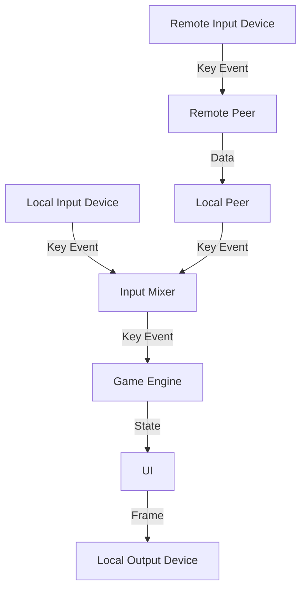

# taiko-game

A taiko game written in Rust.

## Keybindings

- `DON`: `' ' | 'f' | 'g' | 'h' | 'j' | 'c' | 'v' | 'b' | 'n' | 'm'`
- `KAT`: `'d' | 's' | 'a' | 't' | 'r' | 'e' | 'w' | 'q' | 'x' | 'z' | 'k' | 'l' | ';' | '\'' | 'y' | 'u' | 'i' | 'o' | 'p' | ',' | '.' | '/'`
- `CANCEL`: `ESC`

